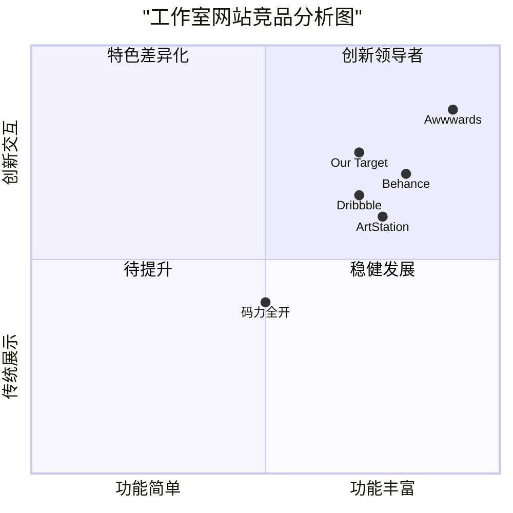

# 工作室网站产品需求文档（PRD）

## 1. 项目信息

### 1.1 基本信息
- 项目名称：studio_portfolio_site
- 技术栈：Vue 3 + Vite + Ant Design Vue
- 浏览器支持：最新版本的Chrome、Firefox、Safari和Edge

### 1.2 项目概述
创建一个专业的工作室展示网站，展示工作室的作品、团队和成就，提供透明的价格信息和财务数据，以建立专业可信的品牌形象。

### 1.3 原始需求
用户要求开发一个工作室网站，包含以下核心页面：
- 首页（图片展示工作室成就）
- 样片网（签约作者作品与价格）
- 插件作品集（大型项目定制的成就）
- 关于我们（成员介绍）
- 联合与代理（合作展示）
- 财务公示（季度应收报告）

## 2. 产品目标

### 2.1 核心目标
1. 展示专业形象：通过精心策划的页面布局和内容展示，树立工作室的专业品牌形象
2. 提升转化率：通过清晰的作品展示和价格信息，促进潜在客户转化
3. 建立信任：通过团队介绍和财务透明度，增强客户信任

### 2.2 用户故事
1. 作为潜在客户，我想浏览工作室的作品集，以便评估其专业能力和风格是否符合我的需求
2. 作为企业客户，我想了解工作室的定制项目经验，以便判断是否能承接我的项目
3. 作为合作伙伴，我想了解工作室的团队构成和财务状况，以便评估合作可能性

## 3. 竞品分析

### 3.1 主要竞品

### 3.2 竞品优劣分析
1. Awwwards
   - 优点：最佳网页设计展示，互动性强
   - 缺点：加载较慢，过于注重视觉效果

2. Behance
   - 优点：作品展示系统完善，社区互动好
   - 缺点：界面较复杂，不够聚焦

3. ArtStation
   - 优点：作品展示效果好，分类清晰
   - 缺点：过于面向数字艺术领域

4. Dribbble
   - 优点：简洁的展示方式，加载快
   - 缺点：作品展示形式单一

5. 码力全开
   - 优点：本地化做得好，技术文档完善
   - 缺点：设计相对保守，互动性不足

## 4. 功能需求

### 4.1 首页（P0）
- 必须：
  * 全屏响应式轮播图展示最新/最佳作品
  * 工作室核心数据展示（项目数、客户数等）
  * 最新作品网格展示区
  * 快速导航到其他核心页面
- 应该：
  * 作品分类快速筛选
  * 轮播图支持视差滚动效果
  * 加载动画和过渡效果
- 可以：
  * 3D展示效果
  * 根据访问时间显示不同主题

### 4.2 样片网（P0）
- 必须：
  * 作品网格式展示
  * 作品详情页
  * 价格表显示
  * 作品分类筛选
- 应该：
  * 作品搜索功能
  * 在线咨询功能
  * 作品标签系统
- 可以：
  * 作品对比功能
  * 收藏夹功能

### 4.3 插件作品集（P0）
- 必须：
  * 大型项目案例展示
  * 项目详情页
  * 技术栈说明
- 应该：
  * 项目效果动态展示
  * 客户反馈展示
- 可以：
  * 项目开发过程展示
  * 技术难点解析

### 4.4 关于我们（P1）
- 必须：
  * 团队成员信息展示
  * 成员技能标签
  * 工作时间显示
- 应该：
  * 团队文化展示
  * 招聘信息
- 可以：
  * 团队日常活动展示
  * 员工故事分享

### 4.5 联合与代理（P1）
- 必须：
  * 合作伙伴展示
  * 合作形式说明
- 应该：
  * 成功合作案例
  * 合作流程说明
- 可以：
  * 合作申请表单
  * 合作伙伴评价

### 4.6 财务公示（P2）
- 必须：
  * 季度财务报告展示
  * 数据可视化图表
- 应该：
  * 历史数据对比
  * 重要指标解释
- 可以：
  * 财务趋势分析
  * 预测报告
